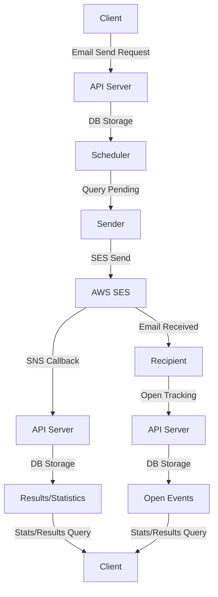

# AWS SES Email Sender

[](https://github.com/gofiber/recipes/tree/master/aws-ses-sender) [](https://stackblitz.com/github/gofiber/recipes/tree/master/aws-ses-sender)

This is an AWS SES-based Golang email delivery service that extracts only the basic sending functionality from [my open source project](https://github.com/lee-lou2/aws-ses-sender-go).

## Features
- [x] Email sending using AWS SES
- [x] Designed with daily limits and per-second sending rates in mind
- [x] Scheduled sending and message grouping
- [x] Email open tracking and result collection
- [x] View daily sending counts and delivery results by message group

### FlowChart



## Requirements

### Essential Requirements
- Go 1.22 or higher
- AWS account and configuration
  - AWS SES service activated
  - Sender email or domain verification completed
  - IAM user with SES permissions
  - AWS Access Key and Secret Key
- PostgreSQL 14.0 or higher
- (Optional) Docker

### AWS SES Configuration
1. Verify sender email/domain in AWS SES console
2. Request removal from SES sandbox mode (for production)
3. Create SNS topic and set up SES feedback notifications
4. Grant following permissions to IAM user

## Project Structure
```
aws-ses-sender/
├── main.go              # Application entry point
├── api/                 # HTTP API related code
│   ├── handler.go       # API handler functions
│   ├── route.go         # API routing configuration
│   ├── server.go        # HTTP server setup/execution
│   └── middlewares.go   # API authentication middleware
├── cmd/                 # Background job code
│   ├── scheduler.go     # Pending email scheduler
│   └── sender.go        # SES email sending processor
├── config/              # Application settings
│   ├── env.go           # Environment variable management
│   └── db.go            # Database connection settings
├── model/               # Database models
│   └── email.go         # GORM model definitions
└── pkg/aws/             # AWS service integration
    └── ses.go           # SES email sending
```

## Setup

### Prerequisites

- Go language development environment
- AWS account and SES service configuration
  - Sender email/domain verification
  - IAM user creation with SES permissions
- PostgreSQL database
- (Optional) Sentry DSN

### Configuration

Create a `.env` file in the project root and set the following environment variables:

```env
# AWS Related
AWS_ACCESS_KEY_ID=your_access_key
AWS_SECRET_ACCESS_KEY=your_secret_key
AWS_REGION=ap-northeast-2
EMAIL_SENDER=sender@example.com

# Server and API
SERVER_PORT=3000
API_KEY=your_api_key
SERVER_HOST=http://localhost:3000

# Database (PostgreSQL)
DB_HOST=localhost
DB_PORT=5432
DB_USER=postgres
DB_PASSWORD=postgres
DB_NAME=postgres

# Sending rate per second
EMAIL_RATE=14

# Sentry (Optional)
SENTRY_DSN=your_sentry_dsn
```

### Installation and Execution

1. Clone repository:
   ```bash
   git clone <repository_URL>
   cd aws-ses-sender
   ```

2. Install dependencies:
   ```bash
   go mod tidy
   ```

3. Run application:
   ```bash
   go run main.go
   ```

## API Endpoints

### Email Sending Request
```
POST /v1/messages
```

Request body example:
```json
{
  "messages": [
    {
      "topicId": "promotion-event-2024",
      "emails": ["recipient1@example.com", "recipient2@example.com"],
      "subject": "Special Promotion Notice",
      "content": "<h1>Hello!</h1><p>Check out our special promotion details.</p>",
      "scheduledAt": "2024-12-25T10:00:00+09:00"
    }
  ]
}
```

### View Topic Sending Statistics
```
GET /v1/topics/:topicId
```

### Email Open Tracking
```
GET /v1/events/open?requestId={requestId}
```

### View Sending Statistics
```
GET /v1/events/counts/sent?hours={hours}
```

### Receive Sending Results (AWS SNS)
```
POST /v1/events/results
```