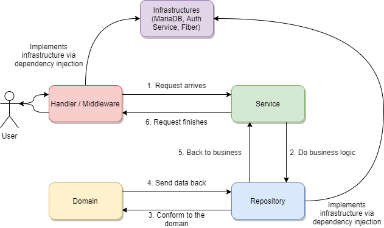

# Docker MariaDB Clean Architecture

A slightly complex REST application with Fiber to showcase Clean Architecture with MariaDB as a dependency with Docker.

## Prerequisites

- Docker Compose for running the application.
- Shell that supports `sh`, `make`, and `curl` for end-to-end testing. UNIX systems or WSL should work fine.
- Postman if you want to test this API with GUI.

## Application

This application is a slightly complex example of a REST API that have four major endpoints. A public user can access the `User`, `Auth`, and `Misc` major endpoints, but they cannot access the `City` endpoint (as it is protected). If one wants to access said endpoint, they have to log in first via the `Auth` endpoint, and only after that they can access the `City` endpoint.

This application uses MariaDB as a database (dockerized), and JWT as an authentication mechanism. This application also showcases how to perform 1-to-many relational mapping in Clean Architecture (one user can have multiple cities), and also the implementation of `JOIN` SQL clause in Go in general.

## Clean Architecture


Clean Architecture is a concept introduced by Robert C. Martin or also known as Uncle Bob. Simply put, the purpose of this architecture is to perform complete separation of concerns. Systems made this way can be independent of frameworks, testable (easy to write unit tests), independent of UI, independent of database, and independent of any external agency. When you use this architecture, it is simple to change the UI, the database, or the business logic.

One thing that you should keep in mind when using this architecture is about Dependency Rule. In Clean Architecture, source code dependency can only point inwards. This means that the 'inner circle' of the system cannot know at all about the outside world. For example, in the diagram above, use-cases knows about entities, but entities cannot know about use-cases. Data formats used in outer circle should not be used by an inner circle.

Because of this, when you change something that is located the innermost of the circle (entities for example), usually you have to change the outer circles. However, if you change something that is not the innermost of the circle (controllers for example), you do not need to change the use-cases and the entities (you may have to change the frameworks and drivers as they are dependent on each other).

If you want to learn more about Clean Architecture, please see the articles that I have attached below as references.

## System Architecture

For the sake of clearness, here is the diagram that showcases the system architecture of this API.



Please refer to below table for terminologies / filenames for each layers that are used in this application. The project structure is referred from [this project](https://github.com/golang-standards/project-layout). In the `internal` package, there are packages that are grouped according to their functional responsibilities. If you open the package, you will see the files that represents the Clean Architecture layers.

For the dependency graph, it is straightforward: handler/middleware depends on service, service depends on repository, and repository depends on domain and the database (via dependency injection). All of the layers are implemented with the said infrastructure (Fiber, MariaDB, and Authentication Service) in above image.

I have slightly modified the layers in this application to conform to my own taste of Clean Architecture.

| Architecture Layer  |    Equivalent Layer    |             Filename             |
| :-----------------: | :--------------------: | :------------------------------: |
| External Interfaces | Presenters and Drivers | `middleware.go` and `handler.go` |
|     Controllers     |     Business Logic     |           `service.go`           |
|      Use Cases      |      Repositories      |         `repository.go`          |
|      Entities       |        Entities        |           `domain.go`            |

Basically, a request will have to go through `handler.go` (and `middleware.go`) first. After that, the program will call a repository or a use-case that is requested with `service.go`. That controller (`service.go`) will call `repository.go` that conforms to the `domain.go` in order to fulfill the request that the `service.go` asked for. The result of the request will be returned back to the user by `handler.go`.

In short:

- `handler.go` and `middleware.go` is used to receive and send requests.
- `service.go` is business-logic or controller (some might have different opinions, but this is my subjective opinion).
- `repository.go` is used to interact to the database (use-case).
- `domain.go` is the 'shape' of the data models that the program use.

For the sake of completeness, here are the functional responsibilities of the project structure.

- `internal/auth` is used to manage authentication.
- `internal/city` is used to manage cities. This endpoint **is protected**.
- `internal/infrastructure` is used to manage infrastructure of the application, such as MariaDB and Fiber.
- `internal/misc` is used to manage miscellaneous endpoints.
- `internal/user` is used to manage users. This endpoint is **not protected**.

Please refer to the code itself for further details. I commented everything in the code, so I hope it is clear enough!

## API Endpoints / Features

This API is divided into four 'major endpoints', which are miscellaneous, users, authentication, and cities.

### Miscellaneous

Endpoints classified here are miscellaneous endpoints.

- `GET /api/v1` for health check.

### Users

Endpoints classified here are endpoints to perform operation on 'User' domain.

- `GET /api/v1/users` to get all users.
- `POST /api/v1/users` to create a user.
- `GET /api/v1/users/<userID>` to get a user.
- `PUT /api/v1/users/<userID>` to update a user.
- `DELETE /api/v1/users/<userID>` to delete a user.

### Authentication

Endpoints classified here are endpoints to perform authentication. In my opinion, this is framework-layer / implementation detail, so there is no 'domain' regarding this endpoint and you can use this endpoint as an enhancement to other endpoints. Authentication in this API is done using JSON Web Tokens.

- `POST /api/v1/auth/login` to log in as the user with ID of 1 in the database. Will return JWT and said JWT will be stored in a cookie.
- `POST /api/v1/auth/logout` to log out. This route removes the JWT from the cookie.
- `GET /api/v1/auth/private` to access a private route which displays information about the current (valid) JWT.

### Cities

Endpoints classified here are endpoints to perform operation on `City` domain. **Endpoints here are protected via JWT in the cookie**, so if you are going to use this endpoint, make sure you are logged in first (or at least have a valid JWT).

- `GET /api/v1/cities` to get all cities.
- `POST /api/v1/cities` to create a new city.
- `GET /api/v1/cities/<cityID>` to get a city.
- `PUT /api/v1/cities/<cityID>` to update a city.
- `DELETE /api/v1/cities/<cityID>` to delete a city.

## Installation

In order to run this application, you just need to do the following commands.

- Clone the repository.

```bash
git clone git@github.com:gofiber/recipes.git
```

- Switch to this repository.

```bash
cd recipes/docker-mariadb-clean-arch
```

- Run immediately with Docker. After you run this command, migration script will be automatically run to populate your dockerized MariaDB.

```bash
make start
```

- Test with Postman (set the request URL to `localhost:8080`) or with the created end-to-end testing script. Keep in mind that the end-to-end script is only available for the first run. If you are trying to run it the second time, you might not be able to get all of the perfect results (because of the auto-increment in the MariaDB). Please run `make stop` and `make start` first if you want to run the test suite again.

```bash
make test
```

- Teardown or stop the container. This will also delete the Docker volume created and will also delete the created image.

```bash
make stop
```

You're done!

## FAQ

Some frequently asked questions that I found scattered on the Internet. Keep in mind that the answers are mostly subjective.

**Q: Is this the right way to do Clean Architecture?**

A: Nope. There are many ways to perform clean architecture - this example being one of them. Some projects might be better than this example.

**Q: Why is authentication an implementation detail?**

A: Authentication is an implementation detail because it does not interact with the use-case or the repository / interface layer. Authentication is a bit strange that it can be implemented in any other routes as a middleware. Keep in mind that this is my subjective opinion.

**Q: Is this the recommended way to structure Fiber projects?**

A: Nope. Just like any other Gophers, I recommend you to start your project by using a single `main.go` file. Some projects do not require complicated architectures. After you start seeing the need to branch out, I recommend you to [split your code based on functional responsibilities](https://rakyll.org/style-packages/). If you need an even more strict structure, then you can try to adapt Clean Architecture or any other architectures that you see fit, such as Onion, Hexagonal, etcetera.

**Q: Is this only for Fiber?**

A: Nope. You can simply adjust `handler.go` and `middleware.go` files in order to change the external interfaces / presenters and drivers layer to something else. You can use `net/http`, `gin-gonic`, `echo`, and many more. If you want to change or add your database, you just need to adjust the `repository.go` file accordingly. If you want to change your business logic, simply change the `service.go` file. As long as you the separation of concerns is done well, you should have no need to change a lot of things.

**Q: Is this production-ready?**

A: I try to make this as production-ready as possible 😉

## Improvements

Several further improvements that could be implemented in this project:

- Add more tests and mocks, especially unit tests (Clean Architecture is the best for performing unit tests).
- Add more API endpoints.
- Add a caching mechanism to the repository layer, such as Redis.
- Add transaction support.
- Maybe try to integrate S3 backend to the repository layer (MinIO is a good choice).
- Maybe add a `domain` folder in the `internal` package where we can leave the entities there?

## Discussion

Feel free to create an issue in this repository (or maybe ask in Fiber's Discord Server) in order to discuss this together!

## References

Thanks to articles and their writers that I have read and found inspiration in!

- [Clean Architecture by Angad Sharma](https://medium.com/gdg-vit/clean-architecture-the-right-way-d83b81ecac6)
- [Clean Architecture by Uncle Bob](https://blog.cleancoder.com/uncle-bob/2012/08/13/the-clean-architecture.html)
- [Clean Architecture with Go by Elton Minetto](https://dev.to/eminetto/clean-architecture-using-golang-5791)
- [Clean Architecture with Go Part 2 by Elton Minetto](https://dev.to/eminetto/clean-architecture-2-years-later-4een)
- [Creating Clean Architecture using Go by @namkount](https://hackernoon.com/creating-clean-architecture-using-golang-9h5i3wgr)
- [Dive to Clean Architecture with Go by Kenta Takeuchi](https://dev.to/bmf_san/dive-to-clean-architecture-with-golang-cd4)
- [Go and Clean Architecture by Reshef Sharvit](https://itnext.io/golang-and-clean-architecture-19ae9aae5683)
- [Go Microservices with Clean Architecture by Jin Feng](https://medium.com/@jfeng45/go-microservice-with-clean-architecture-application-design-68f48802c8f)
- [Go Project Layout Repository](https://github.com/golang-standards/project-layout)
- [Trying Clean Architecture on Go by Imam Tumorang](https://hackernoon.com/golang-clean-archithecture-efd6d7c43047)
