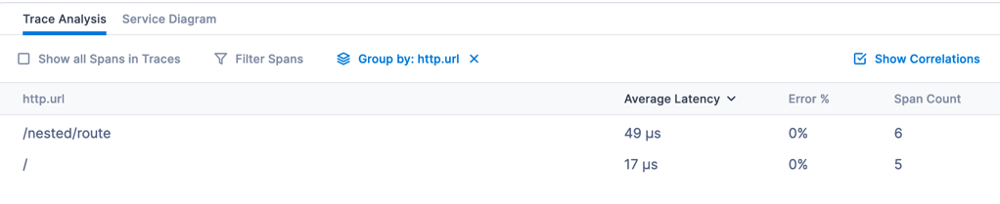
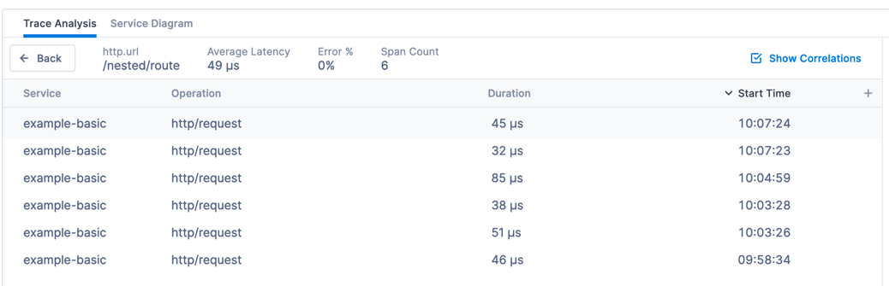
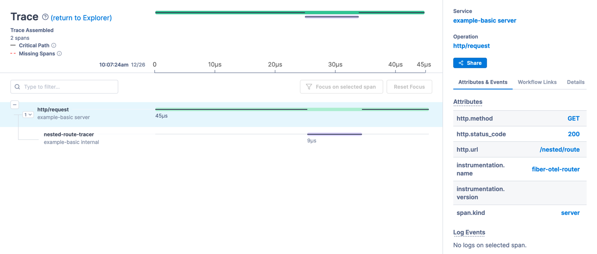
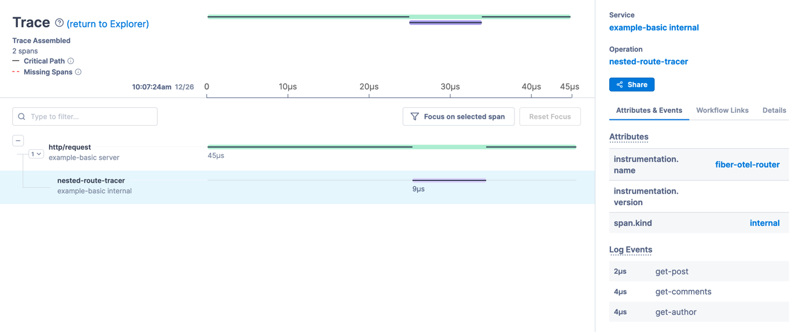

### Basic Example

This example shows how to trace every request (using fiber-opentelemetry package) to you fiber application.

### Step by step

To run this example on your local machine please follow this instruction:

1. Go to https://lightstep.com, create account and follow instruction (or you can just scroll down to see screenshots)
1. You should already have token
1. Fill it into `main.go` file
1. Look at code and comments in `main.go`
1. `go run main.go`
1. Make some request to server, for example:
  1. `curl -kL http://localhost:3000/`
  1. `curl -kL http://localhost:3000/nested/route`
1. Now go to lightstep dashboard to see result https://app.lightstep.com/:
  1. Traces grouped by route:
     
  1. List of traces per route:
     
  1. Trace details
     
  1. Trace events
     

