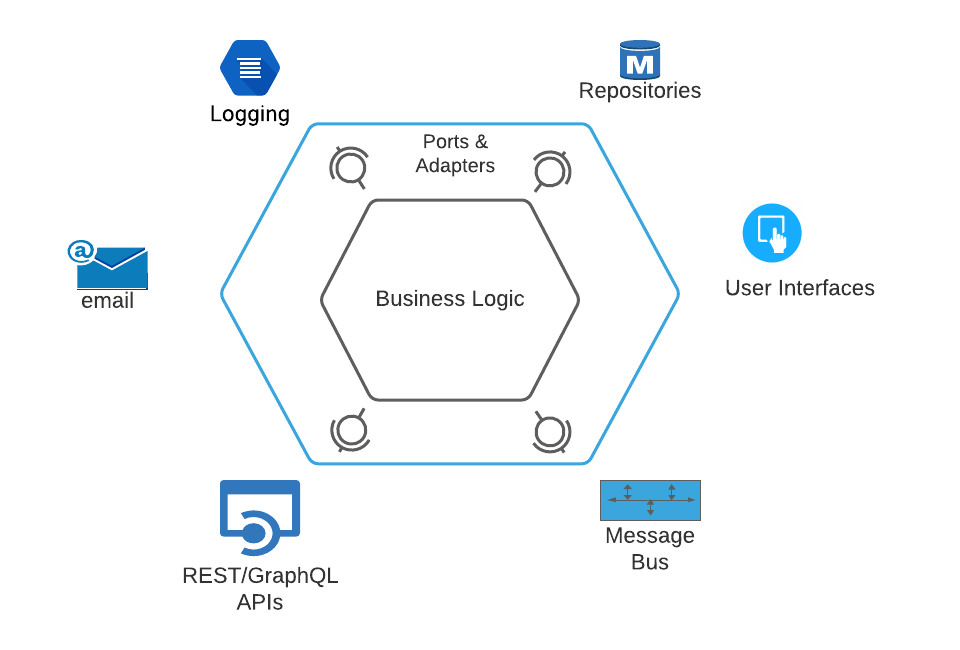

# A Hexagonal Software Architecture in Golang and MongoDB

[](https://github.com/gofiber/recipes/tree/master/hexagonal) [](https://stackblitz.com/github/gofiber/recipes/tree/master/hexagonal)

This project presents a simple product catalogue microservice to demonstrate the principles of a hexagonal software architecture. The microservice exposes a RESTful API that allows consuming applications to perform CRUD operations on a product catalogue. The microservice is developed in Golang, and the product catalogue data is persisted in a MongoDB repository.



## Prerequisites

- Go 1.18 or higher
- MongoDB
- Go modules

## Setup

1. Clone the repository:
    ```sh
    git clone https://github.com/gofiber/recipes.git
    cd recipes/hexagonal
    ```

2. Install dependencies:
    ```sh
    go mod tidy
    ```

3. Configure the MongoDB connection in the `config.json` file:
    ```json
    {
      "DB_URI": "your_mongodb_uri",
      "DB_Name": "your_db_name"
    }
    ```

## Running the Application

1. Run the application:
    ```sh
    go run main.go
    ```

2. The server will start on `http://localhost:3000`.

## Endpoints

| Method | URL              | Description                      |
| ------ | ---------------- | -------------------------------- |
| GET    | /api/v1/products | Retrieves all products           |
| GET    | /api/v1/product/:id | Retrieves a product by ID       |
| POST   | /api/v1/product  | Creates a new product            |
| PUT    | /api/v1/product/:id | Updates an existing product     |
| DELETE | /api/v1/product/:id | Deletes a product               |

## Example Requests

### Get All Products
```sh
curl -X GET http://localhost:3000/api/v1/products
```

### Get Product by ID
```sh
curl -X GET http://localhost:3000/api/v1/product/1
```

### Create a New Product
```sh
curl -X POST http://localhost:3000/api/v1/product -d '{"name": "New Product", "price": 100}' -H "Content-Type: application/json"
```

### Update a Product
```sh
curl -X PUT http://localhost:3000/api/v1/product/1 -d '{"name": "Updated Product", "price": 150}' -H "Content-Type: application/json"
```

### Delete a Product
```sh
curl -X DELETE http://localhost:3000/api/v1/product/1
```

## Hexagonal Architecture

Hexagonal architecture, also known as ports and adapters architecture, is a design pattern used to create loosely coupled application components that can be easily connected to their software environment by means of ports and adapters. This architecture allows an application to be equally driven by users, programs, automated tests, or batch scripts, and to be developed and tested in isolation from its eventual runtime devices and databases.

## Additional Information

For more information on hexagonal architecture, you can refer to the following resources:
- [Hexagonal Architecture](https://alistair.cockburn.us/hexagonal-architecture/)
- [Hexagonal Architecture in Golang](https://medium.com/@matryer/hexagonal-architecture-in-go-2b5e0df2d8f8)
